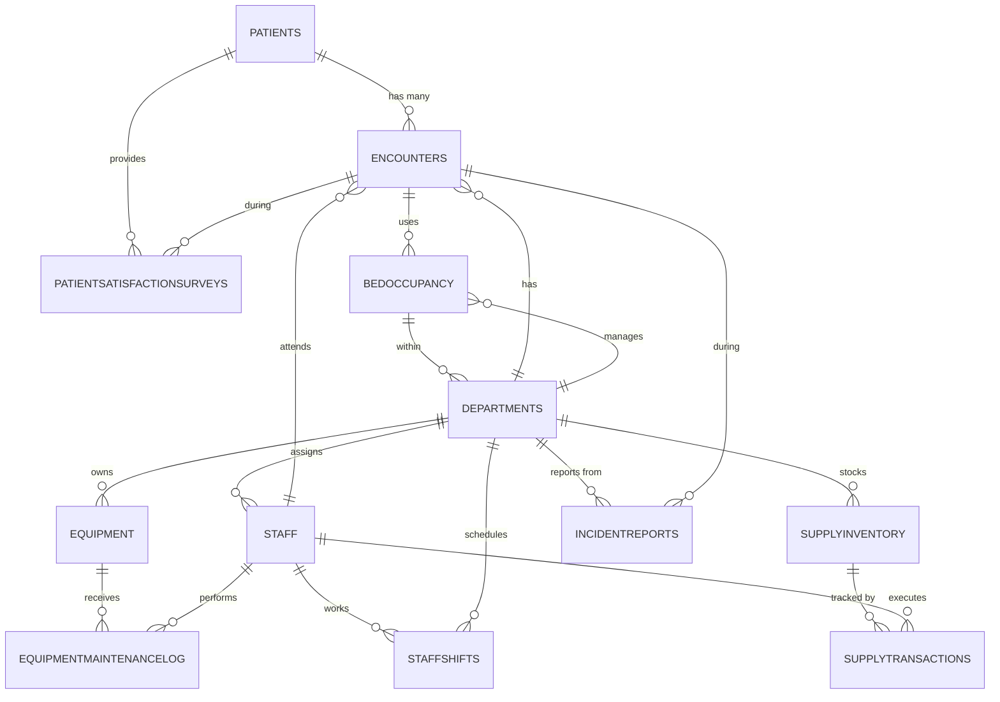

# HospitalOps Database Schema Analysis

## Overview
The HospitalOps database is designed to manage core hospital operations including patient information, staff management, clinical encounters, equipment tracking, incidents, supply chain, and bed occupancy.

---

## Part 1: Entity Listing and Table Purposes

### 1. **Patients**
- **Primary Key**: `PatientID`
- **Purpose**: Stores core patient demographic and registration information
- **Columns**: PatientID, FullName, DOB, Sex, InsuranceType, RegisteredDate
- **Role**: Central entity - each patient record represents an individual receiving care at the facility

### 2. **Staff**
- **Primary Key**: `StaffID`
- **Purpose**: Maintains staff member profiles including roles and assignments
- **Columns**: StaffID, FullName, Role, DepartmentID (FK), HireDate, ShiftPattern, Email
- **Role**: Central entity - each staff member is assigned to a department and has defined work patterns

### 3. **Departments**
- **Primary Key**: `DepartmentID`
- **Purpose**: Defines organizational departments and units within the hospital
- **Columns**: DepartmentID, DepartmentName, Location, Manager
- **Role**: Core reference entity - provides organizational structure for staff, equipment, beds, and supplies

### 4. **Encounters**
- **Primary Key**: `EncounterID`
- **Purpose**: Records individual patient clinical visits or admissions
- **Columns**: EncounterID, PatientID (FK), DepartmentID (FK), AttendingStaffID (FK), AdmissionDate, DischargeDate, ReasonForVisit, PatientCondition, Notes
- **Role**: Central clinical entity - links patients to departments and attending staff for each visit

### 5. **BedOccupancy**
- **Primary Key**: `BedLogID`
- **Purpose**: Tracks bed allocation and usage patterns for patient admissions
- **Columns**: BedLogID, BedNumber, DepartmentID (FK), EncounterID (FK), CheckInDate, CheckOutDate, BedStatus
- **Role**: Operational tracking - manages physical bed resources and patient placement

### 6. **Equipment**
- **Primary Key**: `EquipmentID`
- **Purpose**: Maintains inventory of medical equipment and assets
- **Columns**: EquipmentID, EquipmentName, DepartmentID (FK), PurchaseDate, LastServiceDate, Status, MaintenanceSchedule
- **Role**: Asset management - tracks medical devices and equipment assigned to departments

### 7. **EquipmentMaintenanceLog**
- **Primary Key**: `LogID`
- **Purpose**: Records maintenance activities and service history for equipment
- **Columns**: LogID, EquipmentID (FK), TechnicianStaffID (FK), MaintenanceDate, MaintenanceType, Cost, Status, Notes
- **Role**: Compliance and operations - ensures equipment is properly maintained and serviceable

### 8. **IncidentReports**
- **Primary Key**: `IncidentID`
- **Purpose**: Documents safety incidents, adverse events, or quality issues
- **Columns**: IncidentID, DepartmentID (FK), EncounterID (FK), ReportedDate, IncidentType, Severity, NarrativeText
- **Role**: Quality assurance - tracks and categorizes incidents for analysis and compliance

### 9. **PatientSatisfactionSurveys**
- **Primary Key**: `SurveyID`
- **Purpose**: Captures patient feedback on care quality and service experience
- **Columns**: SurveyID, EncounterID (FK), OverallScore, WaitTimeScore, CommunicationScore, Comments, SurveyDate
- **Role**: Quality metrics - measures patient experience and satisfaction by encounter

### 10. **StaffShifts**
- **Primary Key**: `ShiftID`
- **Purpose**: Schedules and tracks staff work assignments
- **Columns**: ShiftID, StaffID (FK), DepartmentID (FK), ShiftDate, ShiftStart, ShiftEnd, CalledInSick
- **Role**: HR/Operations - manages staff scheduling and tracks actual work patterns

### 11. **SupplyInventory**
- **Primary Key**: `SupplyID`
- **Purpose**: Maintains inventory levels and reorder information for supplies
- **Columns**: SupplyID, ItemName, DepartmentID (FK), UnitOfMeasure, ReorderThreshold, CurrentStock
- **Role**: Supply chain - tracks consumable items needed by departments

### 12. **SupplyTransactions**
- **Primary Key**: `TransactionID`
- **Purpose**: Records supply movements (restocking, usage, transfers)
- **Columns**: TransactionID, SupplyID (FK), TransactionDate, TransactionType, Quantity, StaffID (FK)
- **Role**: Supply chain tracking - creates audit trail of supply usage and movement

---

## Part 2: Primary Keys and Data Types

| Table | PK Column | Data Type | Purpose |
|-------|-----------|-----------|---------|
| Patients | PatientID | int | Unique identifier for patient records |
| Staff | StaffID | int | Unique identifier for staff members |
| Departments | DepartmentID | int | Unique identifier for departments |
| Encounters | EncounterID | int | Unique identifier for clinical visits |
| BedOccupancy | BedLogID | int | Unique identifier for bed usage log entries |
| Equipment | EquipmentID | int | Unique identifier for equipment items |
| EquipmentMaintenanceLog | LogID | int | Unique identifier for maintenance records |
| IncidentReports | IncidentID | int | Unique identifier for incident records |
| PatientSatisfactionSurveys | SurveyID | int | Unique identifier for survey responses |
| StaffShifts | ShiftID | int | Unique identifier for shift assignments |
| SupplyInventory | SupplyID | int | Unique identifier for supply items |
| SupplyTransactions | TransactionID | int | Unique identifier for supply transactions |

---

## Part 3: Foreign Key Relationships

### Relationships Summary (17 total FK constraints):

| Parent Table | FK Column | References | Referenced Table | PK Column | Relationship |
|--------------|-----------|------------|------------------|-----------|--------------|
| BedOccupancy | DepartmentID | → | Departments | DepartmentID | Many beds per department |
| BedOccupancy | EncounterID | → | Encounters | EncounterID | One encounter per bed allocation |
| Encounters | PatientID | → | Patients | PatientID | Many encounters per patient |
| Encounters | DepartmentID | → | Departments | DepartmentID | Many encounters per department |
| Encounters | AttendingStaffID | → | Staff | StaffID | One attending staff per encounter |
| Equipment | DepartmentID | → | Departments | DepartmentID | Many equipment per department |
| EquipmentMaintenanceLog | EquipmentID | → | Equipment | EquipmentID | Many maintenance logs per equipment |
| EquipmentMaintenanceLog | TechnicianStaffID | → | Staff | StaffID | One technician per maintenance log |
| IncidentReports | DepartmentID | → | Departments | DepartmentID | Many incidents per department |
| IncidentReports | EncounterID | → | Encounters | EncounterID | Incident linked to encounter |
| PatientSatisfactionSurveys | EncounterID | → | Encounters | EncounterID | Survey feedback per encounter |
| Staff | DepartmentID | → | Departments | DepartmentID | Many staff per department |
| StaffShifts | StaffID | → | Staff | StaffID | Many shifts per staff member |
| StaffShifts | DepartmentID | → | Departments | DepartmentID | Many shifts per department |
| SupplyInventory | DepartmentID | → | Departments | DepartmentID | Many supply items per department |
| SupplyTransactions | SupplyID | → | SupplyInventory | SupplyID | Many transactions per supply item |
| SupplyTransactions | StaffID | → | Staff | StaffID | Many transactions per staff member |

---

## Part 4: Operational Table Connections and Data Flow

### Core Data Flow Hierarchy:

```
ORGANIZATIONAL STRUCTURE
└── Departments
    ├── Staff (assigned to departments)
    ├── Equipment (assigned to departments)
    ├── SupplyInventory (allocated to departments)
    └── BedOccupancy (bed resources within departments)

CLINICAL OPERATIONS
└── Patients
    ├── Encounters (patient visits to departments)
    │   ├── Attended by Staff
    │   ├── BedOccupancy (where patient is placed)
    │   ├── IncidentReports (any incidents during visit)
    │   └── PatientSatisfactionSurveys (feedback post-visit)
    └── Repeat encounters tracked over time

RESOURCE MANAGEMENT
├── Equipment
│   └── EquipmentMaintenanceLog (service history)
│       └── Performed by Staff
│
└── SupplyInventory
    └── SupplyTransactions (usage and restocking)
        └── Managed by Staff

SCHEDULING & SHIFTS
└── Staff
    └── StaffShifts (work schedule)
        └── Assigned to Departments
```

### Key Operational Flows:

1. **Patient Care Journey**:
   - Patient registers (Patients table)
   - Patient arrives for encounter (Encounters table)
   - Patient is assigned a bed in department (BedOccupancy table)
   - Staff member assigned as attending physician (Encounters.AttendingStaffID)
   - During/after encounter, incident may be reported if needed (IncidentReports)
   - Post-encounter, patient provides satisfaction feedback (PatientSatisfactionSurveys)

2. **Departmental Resource Management**:
   - Equipment is purchased and assigned to departments (Equipment table)
   - Equipment requires scheduled maintenance by technicians (EquipmentMaintenanceLog)
   - Supplies are stocked for departments (SupplyInventory)
   - Supply transactions track usage and restocking (SupplyTransactions)

3. **Staff Scheduling and Assignments**:
   - Staff members belong to departments (Staff.DepartmentID)
   - Staff work patterns defined (Staff.ShiftPattern)
   - Specific shifts scheduled in advance (StaffShifts)
   - Staff may call in sick (StaffShifts.CalledInSick)
   - Staff perform maintenance tasks (EquipmentMaintenanceLog.TechnicianStaffID)

4. **Cross-Department Coordination**:
   - Encounters may involve multiple departments (referrals or transfers)
   - Incidents tracked by department where they occurred
   - Beds managed within department-specific units
   - Supplies and equipment tracked per department

---

## Part 5: Entity-Relationship Diagram



### Relationship Cardinality Reference:
- `||` = One (exactly one)
- `o{` = Zero or More (many)
- `||--o{` = One-to-Many relationship (one parent, multiple children)

---

## Part 6: Detailed Column Specifications

### Patients Table
```
PatientID (int, PK) - Primary identifier
FullName (nvarchar(200), NOT NULL) - Patient full name
DOB (date, NOT NULL) - Date of birth
Sex (nvarchar(30), NULL) - Patient sex/gender
InsuranceType (nvarchar(60), NULL) - Type of insurance coverage
RegisteredDate (date, NULL) - Date of hospital registration
```

### Staff Table
```
StaffID (int, PK) - Primary identifier
FullName (nvarchar(200), NOT NULL) - Staff member full name
Role (nvarchar(60), NOT NULL) - Job title/position
DepartmentID (int, NOT NULL, FK) - Assigned department
HireDate (date, NULL) - Employment start date
ShiftPattern (nvarchar(60), NULL) - Shift assignment pattern
Email (nvarchar(300), NULL) - Contact email
```

### Departments Table
```
DepartmentID (int, PK) - Primary identifier
DepartmentName (nvarchar(100), NOT NULL) - Department name
Location (nvarchar(100), NULL) - Physical location in hospital
Manager (nvarchar(100), NULL) - Department manager name
```

### Encounters Table
```
EncounterID (int, PK) - Primary identifier
PatientID (int, NOT NULL, FK) - Patient visited
DepartmentID (int, NOT NULL, FK) - Department visited
AttendingStaffID (int, NOT NULL, FK) - Attending physician/staff
AdmissionDate (datetime, NOT NULL) - Visit start date/time
DischargeDate (datetime, NULL) - Visit end date/time
ReasonForVisit (nvarchar(200), NULL) - Chief complaint/reason
PatientCondition (nvarchar(100), NULL) - Patient status/severity
Notes (nvarchar(800), NULL) - Clinical notes
```

### BedOccupancy Table
```
BedLogID (int, PK) - Primary identifier
BedNumber (nvarchar(20), NOT NULL) - Physical bed identifier
DepartmentID (int, NOT NULL, FK) - Department bed belongs to
EncounterID (int, NOT NULL, FK) - Patient occupying bed
CheckInDate (date, NOT NULL) - Admission date
CheckOutDate (date, NULL) - Discharge date
BedStatus (nvarchar(50), NULL) - Current status (occupied/available/cleaning)
```

### Equipment Table
```
EquipmentID (int, PK) - Primary identifier
EquipmentName (nvarchar(200), NOT NULL) - Equipment description
DepartmentID (int, NOT NULL, FK) - Assigned department
PurchaseDate (date, NULL) - Acquisition date
LastServiceDate (date, NULL) - Last maintenance date
Status (nvarchar(50), NULL) - Operational status
MaintenanceSchedule (nvarchar(100), NULL) - Planned maintenance frequency
```

### EquipmentMaintenanceLog Table
```
LogID (int, PK) - Primary identifier
EquipmentID (int, NOT NULL, FK) - Equipment serviced
TechnicianStaffID (int, NOT NULL, FK) - Staff performing maintenance
MaintenanceDate (date, NOT NULL) - Service date
MaintenanceType (nvarchar(100), NULL) - Type of service
Cost (money, NULL) - Service cost
Status (nvarchar(50), NULL) - Completion status
Notes (nvarchar(500), NULL) - Details of work performed
```

### IncidentReports Table
```
IncidentID (int, PK) - Primary identifier
DepartmentID (int, NOT NULL, FK) - Department where incident occurred
EncounterID (int, NULL, FK) - Associated patient encounter if applicable
ReportedDate (datetime, NOT NULL) - When incident was reported
IncidentType (nvarchar(100), NULL) - Category of incident
Severity (nvarchar(40), NULL) - Severity level
NarrativeText (nvarchar(1200), NULL) - Detailed incident description
```

### PatientSatisfactionSurveys Table
```
SurveyID (int, PK) - Primary identifier
EncounterID (int, NOT NULL, FK) - Associated encounter/visit
OverallScore (int, NULL) - Overall satisfaction rating
WaitTimeScore (int, NULL) - Wait time satisfaction rating
CommunicationScore (int, NULL) - Staff communication rating
Comments (nvarchar(800), NULL) - Open-ended feedback
SurveyDate (datetime, NULL) - When survey was completed
```

### StaffShifts Table
```
ShiftID (int, PK) - Primary identifier
StaffID (int, NOT NULL, FK) - Staff member scheduled
DepartmentID (int, NOT NULL, FK) - Department assigned
ShiftDate (date, NOT NULL) - Date of shift
ShiftStart (datetime, NOT NULL) - Shift start time
ShiftEnd (datetime, NOT NULL) - Shift end time
CalledInSick (bit, NOT NULL) - Whether staff called out
```

### SupplyInventory Table
```
SupplyID (int, PK) - Primary identifier
ItemName (nvarchar(200), NOT NULL) - Supply item description
DepartmentID (int, NOT NULL, FK) - Department stockpiling item
UnitOfMeasure (nvarchar(60), NULL) - Unit type (boxes, bottles, etc)
ReorderThreshold (int, NULL) - Minimum stock level before reorder
CurrentStock (int, NULL) - Current quantity on hand
```

### SupplyTransactions Table
```
TransactionID (int, PK) - Primary identifier
SupplyID (int, NOT NULL, FK) - Supply item involved
TransactionDate (datetime, NOT NULL) - Transaction date/time
TransactionType (nvarchar(40), NULL) - Type (received, used, transferred)
Quantity (int, NULL) - Quantity changed
StaffID (int, NULL, FK) - Staff executing transaction
```

---

## Summary Statistics

- **Total Tables**: 12
- **Total Primary Keys**: 12 (one per table)
- **Total Foreign Keys**: 17
- **Total Columns**: 79
- **Key Entity Clusters**:
  1. **Organizational** (3 tables): Departments, Staff, StaffShifts
  2. **Clinical** (4 tables): Patients, Encounters, BedOccupancy, PatientSatisfactionSurveys
  3. **Quality/Safety** (1 table): IncidentReports
  4. **Equipment Management** (2 tables): Equipment, EquipmentMaintenanceLog
  5. **Supply Chain** (2 tables): SupplyInventory, SupplyTransactions

---

## Database Design Characteristics

### Strengths:
- **Clear entity separation**: Each table has a single primary responsibility
- **Comprehensive foreign key relationships**: 17 FKs ensure referential integrity
- **Operational tracking**: Maintains full audit trails (maintenance logs, transactions, incident reports)
- **Multiple lookup dimensions**: Tables can be analyzed by department, staff, patient, or time period
- **Scalability**: Identity-based PKs support growth

### Design Pattern:
- **Normalized to 3NF**: Minimal data duplication through relationships
- **Star schema tendencies**: Departments acts as a hub dimension
- **Event-based tracking**: Transactions, shifts, encounters treated as distinct events
- **Temporal data**: Most tables include date/datetime fields for time-series analysis

---

This schema is ready for Hospital Operations Copilot development, supporting queries for:
- Patient demographics and encounter history
- Staff scheduling and assignment analysis
- Equipment maintenance tracking
- Supply chain optimization
- Incident/quality metrics
- Patient satisfaction measurements
- Department-level KPI analysis
