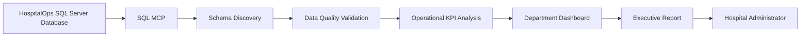

# Architecture

```mermaid
flowchart LR

A[HospitalOps SQL Server Database]

A --> B[SQL MCP]

B --> C[Schema Discovery]

C --> D[Data Quality Validation]

D --> E[Operational KPI Analysis]

E --> F[Department Dashboard]

F --> G[Executive Report]

G --> H[Hospital Administrator]
```